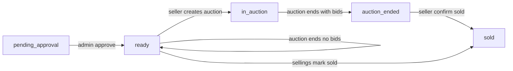

# Secondhand Heart — project reference

This document describes the **implemented** architecture, domain logic, and user-visible flows. For endpoint-by-endpoint detail see [`API.md`](API.md). For bidding rules see [`auction-rules.md`](auction-rules.md). For roles see [`roles-and-permissions.md`](roles-and-permissions.md).

---

## 1. Purpose and scope

**Secondhand Heart** is a web MVP for listing second-hand items in two modes:

- **Auction** (`sale_type: auction`): sellers run time-boxed auctions; buyers bid; a winner is determined at end time.
- **Sellings** (`sale_type: sellings`): fixed-price style listings; buyers contact the seller; the seller can mark sold offline.

**Explicit non-goals (current MVP):**

- No in-app payment or escrow.
- No shipping tracking inside the app.
- Coordination after sale happens **outside** the app (email/phone from profile or contact exchange).

---

## 2. Repository layout

| Area | Stack | Path |
|------|--------|------|
| API | Laravel 12, PHP 8.2+, MySQL | [`backend/`](../backend/) |
| SPA | React, TypeScript, Vite, Bootstrap | [`frontend/`](../frontend/) |
| Docs | Markdown | [`docs/`](.) |

**How the SPA talks to the API**

- Base URL: `VITE_API_BASE_URL` (defaults to `http://127.0.0.1:8000` in [`frontend/src/api/client.ts`](../frontend/src/api/client.ts)).
- Authenticated requests: header `Authorization: Bearer <token>` where `<token>` is returned from `POST /api/login`.
- Token storage: `localStorage` key `auth_token`.

---

## 3. Domain model (high level)

### 3.1 Users

- Stored in `users`; password hashed by Laravel.
- **`role`**: `user` or `admin` (admin-only routes use middleware `admin`).
- **`email_verified_at`**: must be set before login succeeds (`POST /api/login` returns **403** if unverified).
- **`is_banned`**: affects ability to expose seller contact on sellings listings ([`ListingContactController`](../backend/app/Http/Controllers/ListingContactController.php)).
- Profile fields used for contact exchange: name, email, phone, address, optional avatar and Facebook URL.

### 3.2 API tokens

- Table `api_tokens`; bearer token is stored hashed (`token_hash`).
- Issued on login with expiry (see [`AuthController::login`](../backend/app/Http/Controllers/AuthController.php)).
- Middleware [`AuthenticateApiToken`](../backend/app/Http/Middleware/AuthenticateApiToken.php) resolves `Authorization: Bearer`.

### 3.3 One-time codes (`one_time_codes`)

- Used for **email verification** and **password reset** (hashed code, expiry, consumed timestamp).
- Issued by [`IssueOneTimeCode`](../backend/app/Actions/IssueOneTimeCode.php): creates DB row, optional **in-app** notification row (`email_verification_code` / `password_reset_code`), sends email notification.

### 3.4 Listings

- **`sale_type`**: `auction` \| `sellings`.
- **`status`** (string): drives workflows — typical values include `pending_approval`, `ready`, `in_auction`, `auction_ended`, `sold`, `removed` (admin removal uses soft delete where applicable).
- **`is_approved`**: admin gate for going live on public browse (combined with `status`).
- **Images**: `listing_images` table; public URLs via `storage` disk.
- **Location**: `location_city`, `location_region` (required on create/update per validation).
- **`price`**: meaningful for sellings; cleared when switching listing to auction in seller updates.

### 3.5 Auctions

- Belongs to one listing (`listing_id`).
- Fields include `starts_at`, `ends_at`, `starting_bid`, `min_increment`, `status` (`scheduled` \| `active` \| `ended`), `winner_id`, `ended_notified_at`.
- **Derived status** and lifecycle side effects are centralized in [`RefreshAuctionStatus`](../backend/app/Actions/RefreshAuctionStatus.php).

### 3.6 Bids

- Rows in `bids`: `auction_id`, `bidder_id`, `amount`, timestamps.
- Highest bid wins; tie-break: higher **`bids.id`** wins when amounts tie ([`auction-rules.md`](auction-rules.md)).

### 3.7 Reports

- Buyers can report a listing (`reports`); admins resolve them via admin API.

### 3.8 In-app notifications (`app_notifications`)

- Rows keyed by `user_id`, `type`, JSON `data`.
- Read/mark-read via [`NotificationController`](../backend/app/Http/Controllers/NotificationController.php).

---

## 4. Listing lifecycle

Public browse listings (`GET /api/listings`) only include **`is_approved = true`** and **`status = ready`**. Auction listings that are `in_auction` therefore **do not** appear in that feed (buyers discover active auctions via **`GET /api/auctions`**).

**Seller edits**

- Updates while `in_auction` or `auction_ended` are rejected ([`ListingController::update`](../backend/app/Http/Controllers/ListingController.php)).
- Editing after approval generally resets to pending approval (implementation detail in controller).

**Removal**

- Admin can remove listings (soft delete path in admin controller).

---

## 5. Auction lifecycle

### 5.1 Creation

- Authenticated seller: `POST /api/auctions` with `listing_id`, `ends_at`, `starting_bid`, `min_increment`, optional `starts_at`.
- Preconditions: listing belongs to seller, approved, `sale_type === auction`, **`status === ready`** ([`AuctionController::store`](../backend/app/Http/Controllers/AuctionController.php)).
- After create: listing **`status → in_auction`**; `RefreshAuctionStatus` runs once.

### 5.2 Active bidding

- `POST /api/auctions/{id}/bids` (auth, throttled **20/min**).
- Implementation uses **`DB::transaction`** + **`lockForUpdate()`** on the auction row to serialize concurrent bids ([`BidController::store`](../backend/app/Http/Controllers/BidController.php)).
- **409** `BID_TOO_LOW` when bid below minimum (see [`API.md`](API.md)).

### 5.3 Status refresh

[`RefreshAuctionStatus::refresh`](../backend/app/Actions/RefreshAuctionStatus.php) recomputes auction `status` from current time vs `starts_at` / `ends_at`:

- **`ended`** when `ends_at <= now()`.
- When transitioning to ended: set **`winner_id`** from top bid (if any); sync listing:
  - Has winner → listing **`auction_ended`**
  - No bids → listing **`ready`** again

**One-time end notifications** (guarded by `ended_notified_at`):

- Winner (if any): **in-app** `auction_ended_winner` + **email** [`AuctionWonNotification`](../backend/app/Notifications/AuctionWonNotification.php).
- Seller: **in-app** `auction_ended_seller` only (**no seller email** on auction end in current code).

### 5.4 Scheduler (timely endings)

[`backend/routes/console.php`](../backend/routes/console.php) registers `Schedule::command('auctions:process-due')->everyMinute();`. That command loads due auctions and calls `RefreshAuctionStatus`.

**Without** `php artisan schedule:work` (dev) or cron `schedule:run` (prod), endings still occur when something triggers refresh (e.g. `GET /api/auctions/{id}`, bid attempt after end), but **timely** closure + notifications should assume the scheduler runs. See [`README.md`](../README.md).

### 5.5 Public auction index behavior

[`AuctionController::index`](../backend/app/Http/Controllers/AuctionController.php):

- **Default** (no `status` query): only auctions with **`ends_at > now()`** (“live” window).
- **`?status=scheduled|active|ended`**: filters using time windows (`scheduled`/`active`) or **`ends_at <= now()`** for `ended`.

The Browse SPA auction tab ([`BrowsePage.tsx`](../frontend/src/pages/BrowsePage.tsx)) and the standalone [`AuctionsPage.tsx`](../frontend/src/pages/AuctionsPage.tsx) both call **`GET /api/auctions` without `status`**, so **ended auctions are not listed** unless the client adds **`?status=ended`**.

### 5.6 Contact exchange (post-auction)

- `GET /api/auctions/{id}/contact` (auth): allowed after end for **seller** or **winner** only; returns counterpart profile fields ([`AuctionContactController`](../backend/app/Http/Controllers/AuctionContactController.php)).

---

## 6. Sellings flow

- Public listing detail `GET /api/listings/{id}` requires **`is_approved`** only (status can still be visible in payload).
- **Contact seller**: `GET /api/listings/{id}/contact` (auth): requires approved listing, **`status === ready`**, **`sale_type === sellings`**, seller not banned.
- **Mark sold**: `POST /api/listings/{id}/mark-buy-now-sold` (seller).

---

## 7. Frontend routes (SPA)

Defined in [`frontend/src/App.tsx`](../frontend/src/App.tsx):

| Path | Purpose |
|------|---------|
| `/` | Home + stats (`GET /api/stats`) |
| `/browse` | Browse sellings + live auctions |
| `/browse/listings/:listingId` | Public listing detail |
| `/browse/auctions/:auctionId` | Auction detail + bid / contact |
| `/listings/new` | Create listing |
| `/login`, `/register` | Auth |
| `/profile` | Profile |
| `/notifications` | In-app notifications |
| `/my/listings`, `/my/listings/:id`, `/my/listings/:id/edit` | Seller listings |
| `/my/auctions`, `/my/auctions/:id` | Seller auctions |
| `/my/activity` | My bids / my wins |
| `/auctions`, `/auctions/new` | Auction list + create |
| `/admin/listings`, `/admin/users`, `/admin/auctions`, `/admin/reports` | Admin |
| `/listings/:listingId`, `/auctions/:auctionId` | Legacy redirects → `/browse/...` |

Navigation chrome: [`frontend/src/components/Layout.tsx`](../frontend/src/components/Layout.tsx).

**Live updates on auction page**: while auction `status === active`, [`AuctionDetailPage`](../frontend/src/pages/AuctionDetailPage.tsx) polls auction + bids every **3 seconds**.

---

## 8. Notifications matrix

In-app rows use `app_notifications.type`. Laravel **mail** uses classes under [`backend/app/Notifications/`](../backend/app/Notifications/). None of these notifications implement `ShouldQueue` in the current tree — they send **synchronously** when the triggering code runs (no queue worker required for MVP mail).

| Trigger | In-app type | Email |
|---------|-------------|-------|
| Register / request verification code | `email_verification_code` | `EmailVerificationCodeNotification` |
| Forgot password / request code | `password_reset_code` | `PasswordResetCodeNotification` |
| Seller submits listing (pending) | `listing_pending_approval` (admins) | `ListingPendingApprovalNotification` |
| Admin approves listing | `listing_approved` (seller) | `ListingApprovedNotification` |
| User outbid | `outbid` | `AuctionOutbidNotification` |
| Auction ends (winner exists) | `auction_ended_winner` | `AuctionWonNotification` |
| Auction ends (seller) | `auction_ended_seller` | _(none — in-app only)_ |

Frontend URLs in emails should match **`FRONTEND_URL`** in `backend/.env` where templates/notifications build links.

---

## 9. Security and limits

- **Auth**: Bearer tokens on protected routes ([`backend/routes/api.php`](../backend/routes/api.php)).
- **Throttling** (examples): email verification and password reset request/verify routes; `POST /api/auctions/{id}/bids` **20/minute**.
- **Admin**: `admin` middleware on `/api/admin/*`.
- **Debug**: `GET /api/_debug/test-mail` only when `APP_ENV=local`.

---

## 10. Operations checklist

**Backend `.env` (typical)**

- Database: `DB_*`
- `APP_URL`, `FRONTEND_URL` (links in mail/UI helpers)
- Mail: `MAIL_*` for SMTP (e.g. Gmail app password)
- Scheduler/cron: see [`README.md`](../README.md)

**Frontend**

- `VITE_API_BASE_URL` if API is not on default host/port.

**Tests**

- PHPUnit feature tests: [`backend/tests/Feature/`](../backend/tests/Feature/).

---

## 11. Known gaps / intentional MVP limits

- Browse UI does not surface **`GET /api/auctions?status=ended`** unless implemented client-side; API supports an ended archive.
- Auction-end **seller email** is not implemented (in-app only).
- Reporting and moderation are basic (report + admin resolve).

---

## 12. Related files

| Concern | Location |
|---------|-----------|
| HTTP routes | [`backend/routes/api.php`](../backend/routes/api.php) |
| Auction status refresh | [`backend/app/Actions/RefreshAuctionStatus.php`](../backend/app/Actions/RefreshAuctionStatus.php) |
| Scheduler registration | [`backend/routes/console.php`](../backend/routes/console.php) |
| Public stats | [`backend/app/Http/Controllers/PublicStatsController.php`](../backend/app/Http/Controllers/PublicStatsController.php) |
